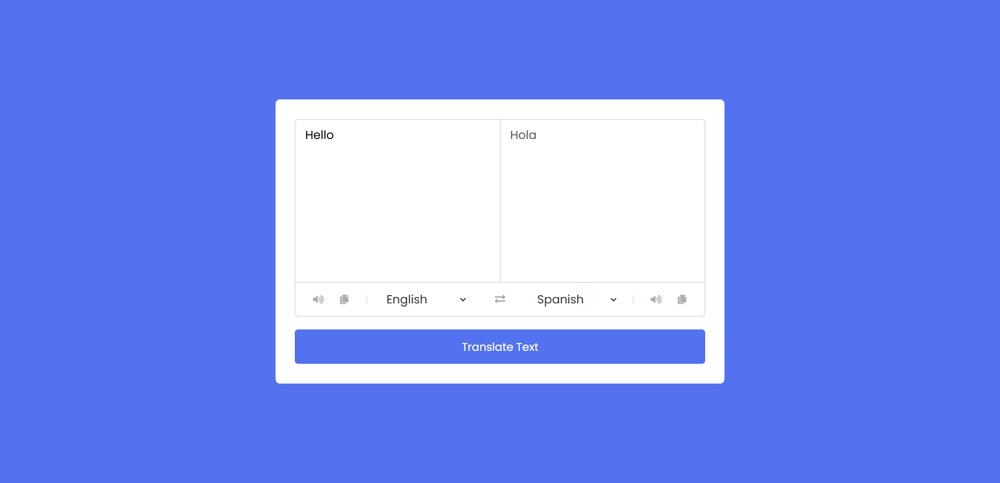

# Language Translator

- This is simple Language translator application which uses third party API known as "mymemory"  to  translate the Language .
It uses simple html,css and javasript for functionality.It helps you to pronounce that sentence as well.

- Live - <https://language-translatorrr.netlify.app>

## Authors

- [RH Bandhan](https://github.com/BANDHAN52)

